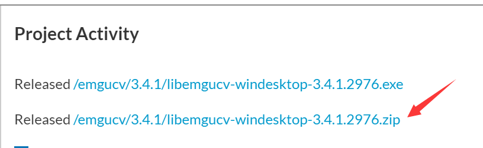
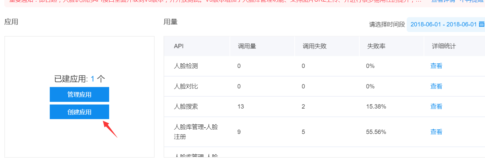

# 基于百度AI+ Emgu CV 实现人脸识别

## 一、Emgu CV

在https://sourceforge.net/projects/emgucv/  可以下载 Emgu CV的基于c#的一些例子

在下载完成后的文件中 打开**\Solution\Windows.Desktop\Emgu.CV.Example.sln**

其中**VideoSurveilance** 跟 **FaceDetection** 这两个项目就是实现人脸识别的关键

## 二、Baidu AI(人脸识别)

 百度人脸识别 百度云地址是 https://console.bce.baidu.com/ai/?_=1527834892162&fromai=1#/ai/speech/overview/index

先注册，并且创建应用

新建项目，把Emgu CV说道的那两个项目合并一下 然后在调用百度的API 基本上就可以了

